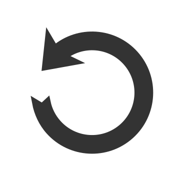

# Pixel Borders    #

A plugin for your pixel-art. This helps you to make borders to your
paint or group layers in krita, even if they are animated.

Add 1px borders choosing between the foreground and background color of the
current view or make a custom border using the avanced features of this plugin.

`Pixel Borders` has been developed among several months in my free time and
now, it's finally available here.

## How to use it :art: ##
1. Open your `Krita` project.
2. Go to `tools > scripts > Pixel Borders` in the menu.
3. Select the target layer (it can be a paint layer or a group one).
4. Configure the new border.
5. Wait for done.


####  Quick Mode ####
Useful when you want a simple border. Choose the method you want and they will
manage all for you.

####  Custom Mode ####
Make soft or rust borders, set its width and choose the animation range. Use
this if it's needed specify more parameters to generate the new border.

Also, you can `disable/enable` the animation features here.

####  Previous Border ####
Repeat the last border into a new layer, or apply it once again with only one
click.

####  Border Methods #####

* _**any-neighbor**_: The pixel becomes opaque when there's at least one opaque pixel next to it.

* _**any-neighbor**_: The pixel becomes opaque when there's at least one opaque pixel next to it.

* _**force**_: same as `any-neighbor` but faster.

* _**corners**_: The pixel becomes opaque if it's qualified as a corner. It is when it has 1 vertical and 1 horizontal opaque neighbor.

* _**not-corners**_: Complement of `corners` method.
qualified as a corner. It is when it has 1 vertical and 1 horizontal opaque neighbor.

* _**strict-horizontal**_: The pixel becomes opaque if it has only horizontal opaque neighbors.
qualified as a corner. It is when it has 1 vertical and 1 horizontal opaque neighbor.

* _**strict-vertical**_: The pixel becomes opaque if it has only vertical opaque neighbors.

|       Method          |         Result        |
| --------------------- | --------------------- |
| `None`                | ![None]               |
| `any-neighbor`        | ![Any-Neighbor]       |
| `corners`             | ![Corners]            |
| `not-corners`         | ![Not-Corners]        |
| `strict-horizontall`  | ![Strict-Horizontal]  |
| `strict-vertical`     | ![Strict-Vertical]    |


## Plugin structure ##
This was made with **PyQt5**, the **Krita's python API** and **built-in**
**python modules**.

`Pixel Borders` has two main sub-packages:

* `core`: Its hearth. Manages and perform all required process to make the
borders from a `source layer`.
* `gui`: The interactive interface to fill out the required and pass it to
the core.

## System Requirements ##
| Minimum (tested) | Recomended   |
| ---------------- | ------------ |
| Krita 4.3.0      | Krita 4.4.x  |
| Python 3.6       | Python 3.9   |
| PyQt5 5.12.x     | PyQt5 5.15.x |

> _undo features_ supported since `Krita 4.4.x`.

### Tested in :computer: ###
| CPU          | RAM     | Krita        | HDD Speed |
| ------------ | ------- | ------------ | --------- |
| Pentium IV + | 1.7 GiB | 4.3.0, 4.4.2 | 7200 RPM  |
| i3         * | 2.0 GiB | 4.4.2        | 5200 RPM  |

> \+ Intel Pentium IV 630 HT (3.0 Ghz)

> \* Intel i3 380M (2.53 Ghz)

## Get The Plugin! :arrow_down_small: ##
### Git ###
1. Go to `Krita's resource folder`, then go to `pykrita/`
2. git clone this repository using
```
git clone https://github.com/sGaps/pixel-borders.git
```
3. Move or copy the .desktop file inside the new folder into your `pykrita/`
folder.

### Zip File ###
1. Download the zip file in the release snippet.
2. Extract the file into the `pykrita` directory inside `Krita's resource folder`
3. Move or copy the .desktop file inside the new folder into your `pykrita/`
folder.

### Zip File + Krita's Plugin Importer ###
1. Download the zip file in the release snippet.
2. Open Krita and click on `tools > scripts > Import Python Plugin`.

**After download**, the directory hierarchy should look like this:

![PluginInstalled]

## Enable the Plugin! :zap: ###

1. After get the plugin, restart/open Krita.
2. Click on `preferences > configure Krita`.
3. Click on `Manage Python Plugins` and click the `Pixel Border's checkbox`
4. Restart Krita.

> **If you want to use this into an animated layer, be sure its document has been saved**. The animation feautres won't work if there's no actual document or working directory to load.

## TO DO :wrench: ##
* Add animation support to unsaved Krita's documents.
* Add an one-click interface to fast tasks.
* Add shortcuts support.
* Add a button to load a valid border recipe.

## Follow me on :star: ##
<a href="https://pixiv.me/artgaps"></a>
<a href="https://github.com/sGaps"></a>
<a href="https://www.deviantart.com/artgaps"></a>
<a href="https://mobile.twitter.com/ArtGaps"></a>
<a href="https://artgaps.newgrounds.com/"></a>

---
_sGaps(Here) | ArtGaps | Gaps(Pixiv)_

[//]:         #------------(References)-------------
[Pixiv]:      <https://pixiv.me/artgaps>
[Newgrounds]: <https://artgaps.newgrounds.com/>
[Github]:     <https://github.com/sGaps>
[DeviantArt]: <https://www.deviantart.com/artgaps>
[PluginInstalled]: <./tutorial/plugin-installed.png>
[//]:         #------------(Borders)-------------
[Any-Neighbor]:      <./tutorial/any-neighbor.png>
[Corners]:           <./tutorial/corners.png>
[Not-Corners]:       <./tutorial/not-corners.png>
[Strict-Horizontal]: <./tutorial/strict-horizontal.png>
[Strict-Vertical]:   <./tutorial/strict-vertical.png>
[None]:              <./tutorial/none.png>

