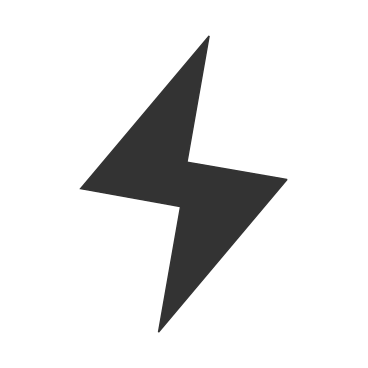

# Pixel Borders    #
**A plugin that helps you to make pixel-art quicker**. A plugin
that uses `Krita's Python API`, `PyQt5` and `Python's built-in`
modules to make borders for your pixel-art characters.

> **`Pixel Borders` performs several operations to make this task**
> **easier, and it works on *paint layers* and *group layers*,**
> **even if these has key-frames on the timeline.**

## Contents Table ##
* [Introduction](#introduction)
    * [An example](#an-example)
    * [Features](#features)
    * [Improve your workflow](#improve-your-workflow)
    * [Group Layers?](#group-layers)
    * [Animated Layers?](#animated-layers)
    * [Limitations](#animated-layers)
* [How to Use it](#how-to-use-it)
    * [Quick Way](#quick-way)
    * [Custom Border](#custom-border)
    * [Even Quicker Way](#even-quicker-way)
    * [Useful Recipes](#useful-recipes)
* [Get the plugin!](#get-the-plugin)
    * [Download with Git](#download-with-git)
    * [Download as zip](#download-as-zip)
* [Enable it on Krita!](#enable-it-on-krita)
* [System Requirements](#system-requirements)
* [Social Media](#social-media)
* [License](./LICENSE.txt)

## Introduction ##
Sometimes, when I'm drawing a pixel-art animation, I try to add borders
to the characters in the scene to get a nice videogame style. But,
That usually happens when there's a lot of key-frames done and spread
among several `Layers`. And often, these are in different group layers.

Then, I have to make these borders manually, doing the same steps which
takes over 3 hours for a small-sized animation. That really takes a lot of
time and It's error prone for worse.

This situation made me to code a simple script to do the work. But I
wasn't sastisfied with it: _it was slow and didn't work on animated_
_layers_, so I decided to improve the way it works and add a GUI to
use it in a more comfortable way and... _The rest of this tale is reflected_
_on the commits of this repository._

_- I just took that idea and made it comfortable to use. -_

Use this plugin to make borders with 1px widths, or make one
smoother adding more steps into the border recipe or maybe,
add colors to the corners of the character or even make a kind of
fractal as a border.

> `Pixel Borders` has been developed among several months in my free
> time and now, It's finally available here!

[Go Top](#pixel-borders---)

### An example ###
| No Borders | Borders   | Recipe                                             |
| ---------- | --------- | -------------------------------------------------- |
| ![SGuy-a]  | ![SGuy-b] | `any-neighbor:1` + `corners:1` + `any-neighbor:1`  |

### Features ###
* This plugin uses `Krita's Python API` and some facilities provided by `PyQt5` package to perform its tasks, so there's no need to install another `python` package for Krita.

* Also, it's compatible with dark and light themes.

* Undo actions are supported since `Krita 4.4.x`

* This defines some methods to make recipes for the new borders which can be used on the `quick mode` and `custom mode`:

    * _**any-neighbor**_: The pixel becomes opaque when there's at least one opaque pixel next to it.

    * _**corners**_: The pixel becomes opaque if it has one vertical and one horizontal opaque neighbor.

    * _**force**_: same as `any-neighbor` but faster.

    * _**not-corners**_: Complement of `corners` method. Useful to make rough borders.

    * _**strict-horizontal**_: The pixel becomes opaque if it has only horizontal opaque neighbors.

    * _**strict-vertical**_: The pixel becomes opaque if it has only vertical opaque neighbors.

|       Method          |         Result        |
| --------------------- | --------------------- |
| `None`                | ![None]               |
| `any-neighbor`        | ![Any-Neighbor]       |
| `corners`             | ![Corners]            |
| `not-corners`         | ![Not-Corners]        |
| `strict-horizontall`  | ![Strict-Horizontal]  |
| `strict-vertical`     | ![Strict-Vertical]    |

### Improve your workflow ###
Play with the different results that can be obtained using
`Pixel Borders`. See how quick this will be achieved with it.

Use the `Use Previous recipe` button to repeat the last recipe used.

### Group Layers? ###
Yes, it works with them. Select the Group layer, and use this plugin just like a normal filter being used on a paint layer.

### Animated Layers? ###
Yes, it works on regular animated layers and on group layers with animated layers inside.

### Limitations ###
Unfortunely, this **doesn't work well with**:
* **Filter masks** that modify the bounding box of their `parent layer`.

That's because these special layers doesn't provide any updated values 
of their parent's bounding box. It will be necessary scan the whole canvas
to known exactly how that bound is, and it drops down the efficiency reached
by using the current `pixel_borders.core`.

> **If the filter mask doesn't modify the bounds** of its parent
> layer, `Pixel Border` **will work fine** with it.

[Go Top](#pixel-borders---)


## How to Use it ##
In your Document of Krita:
1. Click on `tools > Scripting > Pixel Borders`.
1. Write a name for the new Border.
2. Choose the Foreground or the Background color currently used.
3. Choose between the quick mode and the custom mode.
4. Fill out the remaining information.
5. Wait until The new border is done.
6. Press _Ok_.

### Quick Way ###
>  Quick mode has been choosen. Useful to get a simple border.

Select the [method](#features) this plugin will use, then press the number next
to it and set the width of the new border.

### Custom Border ###
>  Custom mode has been choosen. Make complex recipes with it.

There will be a single [method](#features), click on it to select
another and then press the number next to it and set the width.

 | Buttons  | Description                                           |
 | -------- | ----------------------------------------------------- |
 | `Add`    | Press to add a new border at bottom.                  |
 | `Remove` | Press to remove method at bottom.                     |
 | `Clear`  | Press to delete all the methods except the first one. |


### Even Quicker Way ###
>  Previous Border button
has been pressed.

Repeats the previous recipe, applying it on the current selected Layer.
If that Layer has key-frames, it will make animated borders.


### Useful Recipes ###
| Name                 | How to do it                                                    |
| -------------------- | --------------------------------------------------------------- |
| Classic Borders      | Quick mode  + `any-neighbor:1`                                  |
| Classic Borders      | Quick mode  + `any-neighbor:1`                                  |
| Smooth Borders       | Custom mode + `any-neighbor:1` + `corners:1` + `any-neighbor:1` |
| Rough borders        | Custom mode + `any-neighbor:1` + `not-corners:1`                |
| Fuzzy                | Quick mode  + `not-corners:5 or greater`                        |
| Vertical explosion   | Quick mode  + `strict-vertical:10 or greater`                   |
| Horizontal explosion | Quick mode  + `strict-horizontal:10 or greater`                 |

[Go Top](#pixel-borders---)


## Get the plugin! ##
> Krita uses a specific folder to load its Plugins. It is
> `pykrita/` and it's in the folder `~/.local/share/krita/` on Linux, and
> `%appdata%\krita\` on Windows.

### Download with Git ###
1. Open a terminal.
2. Go to your `pykrita/` folder-
3. Clone this repository (I recommend use the lastest release)
```bash
git clone https://github.com/sGaps/pixel-borders.git pixel-borders/
```
4. Copy the `.desktop` file from `pykrita/pixel-borders/` to `pykrita/`.
```bash
cp pixel-borders/pixel-borders.desktop pixel-borders.desktop
```


### Download as zip ###
1. Go to the [release](https://github.com/sGaps/pixel-borders/releases) snippet of this repository.
2. Download the lastest compressed file (`.tar.gz`, or `.zip`)
3. Extract the folder inside the `zip`_(named pixel-borders\*)_ to your `pykrita/` folder.
4. Rename the new folder as `pixel-borders`
5. Copy the file `pixel-border.desktop` from `pykrita/pixel-borders/` to `pykrita/`.


**After Dowload this plugin** the folder hierarchy should look like this:

![PluginInstalled]


[Go Top](#pixel-borders---)


## Enable it on Krita! ##
After [Get the Plugin](#get-the-plugin):
1. Open Krita.
2. Go to `Settings > Configure Krita > Python Plugin Manager`
3. Search the row `Pixel Borders by Gaps` on the list at right.
4. Check its box and restart Krita.


### System Requirements ###
| Minimum (tested) | Recomended   |
| ---------------- | ------------ |
| Krita 4.3.0      | Krita 4.4.x  |
| Python 3.6       | Python 3.9   |
| PyQt5 5.12.x     | PyQt5 5.15.x |

> #### Tested on ####
>
> | CPU          | RAM     | Krita        | HDD Speed |
> | ------------ | ------- | ------------ | --------- |
> | Pentium IV + | 1.7 GiB | 4.3.0, 4.4.2 | 7200 RPM  |
> | i3         * | 2.0 GiB | 4.4.2        | 5200 RPM  |


> | Detailed CPU Info                      |
> | -------------------------------------- |
> | _\+ Intel Pentium IV 630 HT (3.0 Ghz)_ | 
> | _\* Intel i3 380M (2.53 Ghz)_          |


[Go Top](#pixel-borders---)


## Social Media ##
<a href="https://pixiv.me/artgaps"></a>
<a href="https://github.com/sGaps"></a>
<a href="https://www.deviantart.com/artgaps"></a>
<a href="https://mobile.twitter.com/ArtGaps"></a>
<a href="https://artgaps.newgrounds.com/"></a>

> _Gaps | sGaps | ArtGaps_


[//]:         #----------------(Links)-----------------
[Pixiv]:           <https://pixiv.me/artgaps>
[Newgrounds]:      <https://artgaps.newgrounds.com/>
[Github]:          <https://github.com/sGaps>
[DeviantArt]:      <https://www.deviantart.com/artgaps>
[PluginInstalled]: <./tutorial/plugin-installed.png>
[//]:         #---------------(Methods)----------------
[Any-Neighbor]:      <./tutorial/any-neighbor.png>
[Corners]:           <./tutorial/corners.png>
[Not-Corners]:       <./tutorial/not-corners.png>
[Strict-Horizontal]: <./tutorial/strict-horizontal.png>
[Strict-Vertical]:   <./tutorial/strict-vertical.png>
[None]:              <./tutorial/none.png>
[//]:         #----------------------------------------

[SGuy-a]: <./tutorial/spiky-guy.gif>
[SGuy-b]: <./tutorial/spiky-guy-borders2px.gif>
